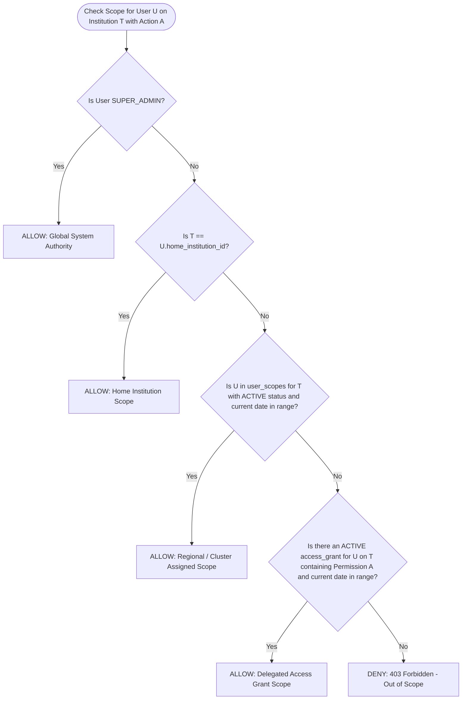

# E-SKLD — ZERO-TRUST AUTHORIZATION MATRIX & SCOPE RESOLUTION

## 1. Zero-Trust Authorization Formula

The backend Authorization Engine evaluates every incoming request against a 6-factor policy function:

$$\text{Authorize}(u, a, r, s, c) \iff \mathcal{R}(u) \land \mathcal{P}(u, a) \land \mathcal{S}(u, r.\text{inst}, a) \land \mathcal{W}(s, u, a) \land \mathcal{A}(u, r)$$

Where:
- $u$: Actor / Authenticated User
- $a$: Requested Action / Atomic Permission (e.g. `VIEW`, `EDIT`, `SUBMIT`, `VERIFY`, `APPROVE`)
- $r$: Target Resource (Submission, Unit, Position, Access Grant, etc.)
- $s$: Current Workflow State of the Resource (e.g. `DRAFT`, `ADMIN_REVIEW`, `APPROVED`)
- $c$: Execution Context (Time, IP, Date)

### The 5 Zero-Trust Gates:
1. $\mathcal{R}(u)$: **Active User Check** — User account is `ACTIVE` and role is valid.
2. $\mathcal{P}(u, a)$: **Role-Permission Check** — User's assigned Role possesses atomic permission $a$ in `role_permissions`.
3. $\mathcal{S}(u, r.\text{inst}, a)$: **Scope Resolution** — User possesses authority over the target institution for action $a$.
4. $\mathcal{W}(s, u, a)$: **State Machine Lock** — Resource's current state allows actor with role $\mathcal{R}(u)$ to perform action $a$.
5. $\mathcal{A}(u, r)$: **Active Assignee Lock** — If action is `VERIFY` or `APPROVE`, actor $u$ must be the currently active assignee in `verifier_assignments`.

---

## 2. Baseline Role-Permission Matrix (21 Atomic Permissions)

| Category | Permission Code | USER | ADMIN | VERIFIER | SUPER_ADMIN | Description |
|---|---|:---:|:---:|:---:|:---:|---|
| **DATA_MANAGEMENT** | `VIEW` | ✅ | ✅ | ✅ | ✅ | View institutional SOTK data |
| | `CREATE` | ✅ | ❌ | ❌ | ❌ | Create new submission drafts |
| | `EDIT` | ✅ | ❌ | ❌ | ❌ | Modify submission draft or revision |
| | `DELETE_DRAFT` | ✅ | ❌ | ❌ | ❌ | Delete unsubmitted draft |
| | `VIEW_HISTORY` | ✅ | ✅ | ✅ | ✅ | View past snapshot versions |
| | `EXPORT` | ✅ | ✅ | ✅ | ✅ | Download SOTK structures / PDF |
| **WORKFLOW** | `SUBMIT` | ✅ | ❌ | ❌ | ❌ | Submit draft or revision to Gate 1 |
| | `REVIEW` | ❌ | ✅ | ✅ | ❌ | Open and review incoming submissions |
| | `RETURN_REVISION`| ❌ | ✅ | ✅ | ❌ | Return submission with revision notes |
| | `FORWARD_TO_VERIFIER` | ❌ | ✅ | ❌ | ✅ | Pass Gate 1 and forward to Gate 2 |
| | `FORWARD_TO_USER`| ❌ | ✅ | ❌ | ✅ | Forward Gate 2 revisions to User |
| | `ASSIGN_VERIFIER`| ❌ | ✅ | ❌ | ✅ | Assign specific Verifier to submission |
| | `REASSIGN_VERIFIER`| ❌ | ❌ | ❌ | ✅ | Override / reassign Verifier assignment |
| | `VERIFY` | ❌ | ❌ | ✅ | ❌ | Perform substantive technical verification |
| | `APPROVE` | ❌ | ❌ | ✅ | ❌ | Grant final official approval |
| **SYSTEM_ADMIN** | `MANAGE_USER` | ❌ | ✅ | ❌ | ✅ | Manage users within institutional scope |
| | `GRANT_ACCESS` | ❌ | ✅ | ❌ | ✅ | Issue time-bound access grants |
| | `REVOKE_ACCESS` | ❌ | ✅ | ❌ | ✅ | Revoke delegated access grants |
| | `MANAGE_SCOPE` | ❌ | ❌ | ❌ | ✅ | Assign/manage Admin and Verifier scopes |
| | `VIEW_AUDIT` | ❌ | ❌ | ❌ | ✅ | View national audit logs and forensics |
| | `MANAGE_MASTER_DATA` | ❌ | ❌ | ❌ | ✅ | Manage master K/L/D, positions, echelons |
| **Total Permissions** | **21 Permissions** | **7** | **11** | **7** | **13** | **38 Mappings Total** |

---

## 3. Scope Resolution Priority & Lifecycle

Scope resolution determines whether user $u$ has authority over target institution $T$ for action $a$:

$$\mathcal{S}(u, T, a) = \text{GlobalScope}(u) \lor \text{HomeInstitutionScope}(u, T) \lor \text{UserScope}(u, T) \lor \text{AccessGrantScope}(u, T, a)$$

### Scope Resolution Rules:
1. **Priority 1 (Global Scope)**: `SUPER_ADMIN` has global authority across all institutions for governance actions.
2. **Priority 2 (Home Institution)**: `USER` naturally possesses authority over their `home_institution_id`.
3. **Priority 3 (User Scope)**: `ADMIN` and `VERIFIER` have authority over institutions assigned in `user_scopes` where:
   - `status = 'ACTIVE'`
   - `CURRENT_DATE BETWEEN start_date AND end_date`
4. **Priority 4 (Access Grant)**: Delegated cross-institution access is valid **only** if:
   - `access_grants.status = 'ACTIVE'`
   - `CURRENT_DATE BETWEEN access_grants.start_date AND access_grants.end_date`
   - `access_grant_permissions` contains permission $a$.
   - **Crucial Rule**: An Access Grant **never** alters or escalates the user's role. It only delegates specific atomic permissions over the target institution.

---

## 4. State-Aware Dynamic Authorization Matrix

Permissions are dynamically filtered based on the current state of the submission:

| Workflow State | USER Allowed Actions | ADMIN Allowed Actions | VERIFIER Allowed Actions | SUPER_ADMIN Allowed Actions |
|---|---|---|---|---|
| `DRAFT` | `VIEW`, `EDIT`, `DELETE_DRAFT`, `SUBMIT`, `VIEW_HISTORY`, `EXPORT` | `VIEW`, `VIEW_HISTORY` | `VIEW` | `VIEW`, `VIEW_HISTORY`, `EXPORT` |
| `SUBMITTED_TO_ADMIN` | `VIEW`, `VIEW_HISTORY`, `EXPORT` (Read-only lock) | `VIEW`, `REVIEW`, `RETURN_REVISION`, `FORWARD_TO_VERIFIER`, `ASSIGN_VERIFIER` | `VIEW` | `VIEW`, `VIEW_HISTORY`, `EXPORT` |
| `ADMIN_REVIEW` | `VIEW`, `VIEW_HISTORY`, `EXPORT` (Read-only lock) | `VIEW`, `REVIEW`, `RETURN_REVISION`, `FORWARD_TO_VERIFIER`, `ASSIGN_VERIFIER` | `VIEW` | `VIEW`, `VIEW_HISTORY`, `EXPORT` |
| `REVISION_BY_ADMIN` | `VIEW`, `EDIT`, `SUBMIT`, `VIEW_HISTORY`, `EXPORT` | `VIEW`, `VIEW_HISTORY` | `VIEW` | `VIEW`, `VIEW_HISTORY`, `EXPORT` |
| `ADMIN_PASSED` | `VIEW`, `VIEW_HISTORY`, `EXPORT` (Read-only lock) | `VIEW`, `ASSIGN_VERIFIER` | `VIEW`, `REVIEW` (If Assigned) | `VIEW`, `REASSIGN_VERIFIER`, `EXPORT` |
| `VERIFIER_REVIEW` | `VIEW`, `VIEW_HISTORY`, `EXPORT` (Read-only lock) | `VIEW`, `VIEW_HISTORY` | `VIEW`, `REVIEW`, `RETURN_REVISION`, `VERIFY`, `APPROVE` (If Assigned) | `VIEW`, `REASSIGN_VERIFIER`, `EXPORT` |
| `REVISION_BY_VERIFIER` | `VIEW`, `EDIT`, `SUBMIT`, `VIEW_HISTORY`, `EXPORT` | `VIEW`, `FORWARD_TO_USER` | `VIEW` | `VIEW`, `VIEW_HISTORY`, `EXPORT` |
| `APPROVED` | `VIEW`, `VIEW_HISTORY`, `EXPORT` (Read-only immutable) | `VIEW`, `VIEW_HISTORY`, `EXPORT` (Read-only immutable) | `VIEW`, `VIEW_HISTORY`, `EXPORT` (Read-only immutable) | `VIEW`, `VIEW_HISTORY`, `EXPORT` (Read-only immutable) |

---

## 5. Active Assignee Lock Policy ($\mathcal{A}$)

To enforce strict personal accountability and prevent conflicting verifications:
1. When a submission enters `ADMIN_PASSED` or `VERIFIER_REVIEW`, a Verifier is assigned via `verifier_assignments`.
2. Even if a user has the `VERIFIER` role and has the institution in their `user_scopes`, they **CANNOT** execute `VERIFY` or `APPROVE` on that submission **unless**:
   - `verifier_assignments.submission_id = submission.id`
   - `verifier_assignments.verifier_id = current_user.id`
   - `verifier_assignments.status IN ('ASSIGNED', 'IN_REVIEW')`
3. Super Admin can reassign via `REASSIGN_VERIFIER`, which sets the old assignment status to `REASSIGNED` and creates a new active assignment.
