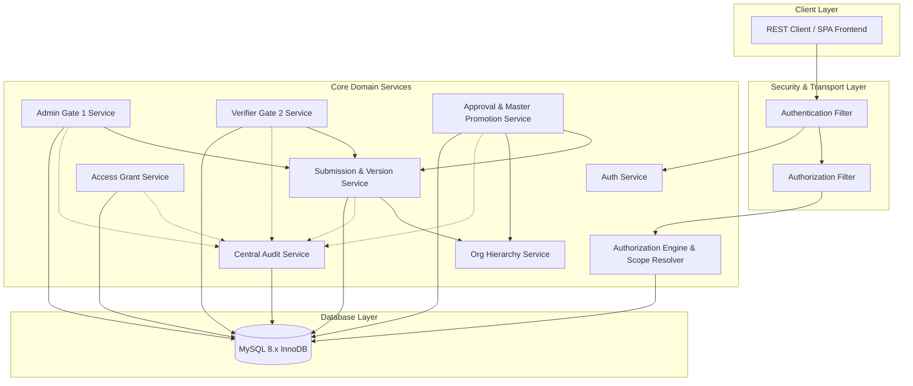

# E-SKLD — BACKEND ARCHITECTURE SPECIFICATION V1

## 1. Executive Summary & Design Principles

The backend of **E-SKLD KemenPANRB** is designed as a **Modular Monolith** built on **CodeIgniter 4 (PHP 8.0+)** and backed by **MySQL 8.x (InnoDB)**. It prioritizes strict data integrity, zero-trust authorization, defensive security, and maintainability for internal government institutional data governance.

### Core Architectural Principles:
1. **Zero-Trust Authorization**: Every request is evaluated against a 6-factor tuple: `(Actor, Role, Atomic Permission, Institution Scope, Current Workflow State, Active Assignment)`.
2. **Domain-Driven Modular Monolith**: Highly cohesive modules organized by business domain with clear boundaries and well-defined service interfaces.
3. **Layered Separation of Concerns**: Strict separation between Transport (Controllers/Filters), Domain Logic (Services), Data Access (Models/Repositories), and Persistence (MySQL).
4. **Defensive Data Integrity**: Business state transitions, hierarchy sanity, access grants, and audit trails are guarded at both the database layer (FK/UK/Check/Transactions) and the application service layer.
5. **Immutable Audit Trail**: Critical lifecycle transitions automatically emit immutable, tamper-evident audit records containing actor identity, previous state, new state, and JSON diffs.

---

## 2. Technology Stack & Runtime Environment

| Component | Technology | Version | Purpose |
|---|---|---|---|
| **Programming Language** | PHP (CLI & FPM) | `8.0.30+` | Core Backend Runtime |
| **Framework** | CodeIgniter 4 | `4.4.x / 4.5.x` | HTTP Routing, MVC, Validation, DB Layer |
| **Database Engine** | MySQL / MariaDB (InnoDB) | `8.0+ / 10.4+` | Relational Storage, FK, ACID Transactions |
| **Authentication Strategy** | Stateless JWT / Session Token | HMAC-SHA256 | API Authentication & Identity Token |
| **Password Hashing** | Argon2id / Bcrypt (`PASSWORD_BCRYPT`) | Cost factor 12 | Secure Credential Storage |
| **Serialization** | JSON (`application/json`) | RFC 8259 | Unified API Contract & Audit Payload |

---

## 3. Module Inventory & Domain Boundaries

The application is structured into **16 domain modules**:

```
app/
├── Modules/
│   ├── Auth/                  # Identity, Login, Token Management, Password Reset
│   ├── Authorization/         # Central Policy Engine, Scope Resolver, State Gatekeeper
│   ├── UserManagement/        # User CRUD, Role Assignment, Status Lifecycle
│   ├── Institution/           # K/L/D Master Data & Organizational Root
│   ├── OrgStructure/          # Master Unit Hierarchy, Anti-Cycle Tree Service
│   ├── Position/              # Master Formations & Echelon Positions
│   ├── Submission/            # Proposal Workspace Header & Lifecycle
│   ├── SubmissionVersion/     # Immutable Snapshot Versioning (Units & Positions)
│   ├── AdminReview/           # Gate 1 Administrative Review & Forwarding
│   ├── VerifierAssignment/    # Gate 2 Workload Distribution & Single-Assignee Lock
│   ├── Verification/          # Technical Review Records (Gate 1 & Gate 2)
│   ├── Revision/              # Granular Unit-Level Issue Tracking & Resolution
│   ├── Approval/              # Gate 2 Final Approval, SK Numbering, Master Promotion
│   ├── AccessRequest/         # Cross-Institution Access Applications
│   ├── AccessGrant/           # Time-Bound Delegated Access Lifecycle & Revocation
│   └── AuditLog/              # Central Append-Only Audit Trail Service
```

### Domain Boundaries & Inter-Module Interaction Matrix



---

## 4. Layered Architectural Pattern

Each module follows a strict 4-tier layer pattern:

```
[ HTTP Request ]
       │
       ▼
1. Transport Tier (Controllers & HTTP Filters)
   - Route dispatching, Token parsing, Input sanitization, HTTP Status mapping
       │
       ▼
2. Domain Logic Tier (Services & Handlers)
   - Business rule enforcement, Authorization Policy checks, State Machine transitions
   - Anti-cycle hierarchy checks, Atomic Transaction orchestration
       │
       ▼
3. Data Access Tier (Repositories & CodeIgniter Models)
   - Strongly typed queries, Query Builder, Scope filtering, Entity hydration
       │
       ▼
4. Persistence Tier (MySQL 8.x Engine)
   - Relational tables, Foreign Key constraints, Row-level locking (SELECT ... FOR UPDATE)
```

---

## 5. Dependency Injection & Service Registry

To maintain loose coupling and facilitate automated testing:
- Services are registered as singletons in `app/Config/Services.php`.
- Common shared services include:
  - `Services::auth()`
  - `Services::authorization()`
  - `Services::audit()`
  - `Services::hierarchy()`
  - `Services::submission()`
  - `Services::approval()`

---

## 6. Central Database Transaction Strategy

State-mutating operations that span multiple tables **MUST** be wrapped in atomic database transactions (`$db->transBegin()`, `$db->transCommit()`, `$db->transRollback()`).

### Mandatory Transactional Operations:
1. **Submission Creation / Version Cloning**: Inserting `submissions`, `submission_versions`, `submission_units`, `submission_positions`, and emitting `audit_logs`.
2. **Gate 1 Pass & Assignment**: Updating `submissions.current_state = 'ADMIN_PASSED'`, inserting `verification_records`, inserting `verifier_assignments`, and emitting `audit_logs`.
3. **Gate 2 Final Approval & Promotion**:
   - Acquiring row lock on `submissions` and `submission_versions` via `SELECT ... FOR UPDATE`.
   - Inserting `approval_records`.
   - Updating `submissions.current_state = 'APPROVED'`.
   - Updating `verifier_assignments.status = 'COMPLETED'`.
   - Promoting snapshot `submission_units` $\rightarrow$ `organizational_units` (Active Master).
   - Promoting snapshot `submission_positions` $\rightarrow$ `positions` (Active Master).
   - Emitting `audit_logs` record.
4. **Access Grant Issuance / Revocation**: Mutating `access_grants`, `access_grant_permissions`, and emitting `audit_logs`.
