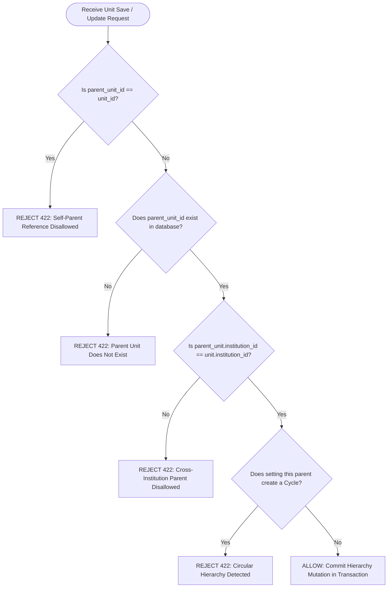

# E-SKLD — DEFENSIVE SECURITY ARCHITECTURE & THREAT MODEL

## 1. Threat Modeling & Defensive Controls Matrix

| Threat Category | Specific Attack Vector | E-SKLD Defensive Control | Layer of Enforcement |
|---|---|---|---|
| **BOLA / IDOR** | Attacker manipulates `submission_id` or `institution_id` in URL/payload to access or mutate unauthorized data | Scope Resolver verifies actor's Home Base, `user_scopes`, and active `access_grants` on every resource query. Direct ID access without verified scope returns `403 Forbidden`. | Application Service Layer |
| **Broken Access Control** | User or Admin attempts to call `/approve` or `/verify` | Role-Permission Engine blocks non-VERIFIER roles. Active Assignee Lock blocks non-assigned Verifiers. | Controller Filter & Service Layer |
| **Privilege Escalation** | Admin grants self permissions or attempts to create Super Admin user | Database CHECK constraint `chk_access_grants_no_self_grant` blocks self-grants. User Service blocks role assignment equal to or above actor's rank. | Database Engine + Service Layer |
| **Mass Assignment** | Malicious payload injects `currentState = "APPROVED"` or `role_id = 4` during submission update | CodeIgniter Models use strict `$allowedFields`. State transitions can only occur via dedicated State Machine transition methods. | Model & Service Layer |
| **SQL Injection** | SQL payload injected via search filters or form inputs | 100% Parameter Binding using CodeIgniter 4 Query Builder / PDO Prepared Statements. No raw string concatenation. | Data Access Layer |
| **Brute Force Login** | Credential stuffing on `/api/v1/auth/login` | Rate Limiter / Throttler (Maximum 5 attempts per minute per IP). Account lockout after 5 consecutive failures. | Auth Filter / Cache Layer |
| **Token Hijacking** | Stolen access token used indefinitely | Short-lived Access Tokens (15–60 minutes) + Refresh Token Rotation with single-use revocation. | Auth Service & Storage |
| **Tree Cycle / Hierarchy Bomb** | Circular hierarchy $A \rightarrow B \rightarrow C \rightarrow A$ creating infinite recursion | Hierarchy Service executes Adjacency List Cycle Detector before saving parent-child updates. | Org Hierarchy Service |
| **Audit Log Tampering** | Malicious actor modifies or deletes audit logs | Append-only database table without update/delete routes. Dedicated DB user lacks `UPDATE` and `DELETE` grants on `audit_logs`. | Database User Permissions |

---

## 2. Hierarchy Business Integrity & Cycle Prevention Algorithm

Because the DDL `CHECK` constraint on the auto-increment column `id` was removed to adhere to MySQL 8 engine standards, the **Org Hierarchy Service** implements a 4-step validation pipeline before committing any unit creation or parent reassignment:



### Cycle Detection Algorithm (Depth-First Search / Recursive Ancestor Traversal):
```php
public function validateNoCircularHierarchy(int $unitId, ?int $newParentId): bool
{
    if ($newParentId === null) {
        return true; // Root unit has no cycle
    }
    if ($unitId === $newParentId) {
        return false; // Direct self-reference
    }

    $currentParentId = $newParentId;
    $visited = [$unitId => true];

    while ($currentParentId !== null) {
        if (isset($visited[$currentParentId])) {
            return false; // Cycle detected!
        }
        $visited[$currentParentId] = true;

        $parent = $this->unitModel->find($currentParentId);
        if (!$parent) {
            return false; // Broken branch
        }
        $currentParentId = $parent->parent_unit_id;
    }

    return true;
}
```

---

## 3. Concurrency & Race Condition Defense

State transitions and approvals are vulnerable to race conditions (e.g. two admins approving or assigning simultaneously). E-SKLD employs **Pessimistic Row-Level Locking** via `SELECT ... FOR UPDATE`:

```php
public function executeApproval(int $submissionId, int $verifierId, string $skNumber, ?string $notes): ApprovalResult
{
    $db = \Config\Database::connect();
    $db->transBegin();

    try {
        // 1. Acquire exclusive row lock on submission header
        $submission = $db->table('submissions')
            ->where('id', $submissionId)
            ->forUpdate()
            ->get()
            ->getRow();

        if (!$submission || $submission->current_state !== 'VERIFIER_REVIEW') {
            throw new StateMachineConflictException("Submission is not in VERIFIER_REVIEW state.");
        }

        // 2. Validate active assignment with lock
        $assignment = $db->table('verifier_assignments')
            ->where('submission_id', $submissionId)
            ->where('verifier_id', $verifierId)
            ->whereIn('status', ['ASSIGNED', 'IN_REVIEW'])
            ->forUpdate()
            ->get()
            ->getRow();

        if (!$assignment) {
            throw new UnauthorizedAssigneeException("Actor is not the active assignee.");
        }

        // 3. Insert Approval Record (Enforced by UNIQUE KEY on version_id)
        $db->table('approval_records')->insert([
            'version_id'      => $activeVersionId,
            'approver_id'     => $verifierId,
            'approval_number' => $skNumber,
            'approval_notes'  => $notes,
            'approved_at'     => date('Y-m-d H:i:s')
        ]);

        // 4. Update state to APPROVED
        $db->table('submissions')
            ->where('id', $submissionId)
            ->update(['current_state' => 'APPROVED']);

        // 5. Complete assignment
        $db->table('verifier_assignments')
            ->where('id', $assignment->id)
            ->update(['status' => 'COMPLETED']);

        // 6. Promote Snapshot to Active Master Tables
        $this->promoteSnapshotToActiveMaster($activeVersionId, $submission->institution_id);

        // 7. Emit Audit Log
        $this->auditService->log([
            'actor_id'        => $verifierId,
            'actor_role'      => 'VERIFIER',
            'action_event'    => 'GATE2_FINAL_APPROVED',
            'resource_entity' => 'submissions',
            'resource_id'     => $submissionId,
            'payload_new'     => json_encode(['approvalNumber' => $skNumber, 'state' => 'APPROVED'])
        ]);

        $db->transCommit();
        return new ApprovalResult(true);
    } catch (\Throwable $e) {
        $db->transRollback();
        throw $e;
    }
}
```

---

## 4. Critical Findings & Enforcement Layer Clarification

Based on the functional test suite results ([`database/docs/FUNCTIONAL_TEST_REPORT.md`](file:///c:/Users/Berlin%20Sugiyanto/KemenPANRB/database/docs/FUNCTIONAL_TEST_REPORT.md)):

### A. TC-16 (Deletion of Approved Submission):
- **Actual Enforcement Layer**: **Database Engine (MySQL Foreign Key `ON DELETE RESTRICT`)**.
- **Explanation**: The presence of child records in `approval_records` and `verification_records` with `ON DELETE RESTRICT` foreign keys strictly prevents deletion of `submission_versions` and parent `submissions` directly at the database engine level (raising MySQL Error 1451).

### B. TC-H1 & TC-H4 (Hierarchy Anti-Self & Anti-Cycle):
- **Actual Enforcement Layer**: **Application Service Layer (`OrgHierarchyService`)**.
- **Explanation**: Because the DDL `CHECK` constraint on `id` was removed to comply with MySQL 8 `AUTO_INCREMENT` rules, TC-H1 and TC-H4 cannot be enforced by static DDL table constraints alone. They **MUST be verified and tested via backend unit/integration tests** once the `OrgHierarchyService` implementation code is written.
- **Classification**: **`NEEDS BACKEND IMPLEMENTATION TEST`**.
