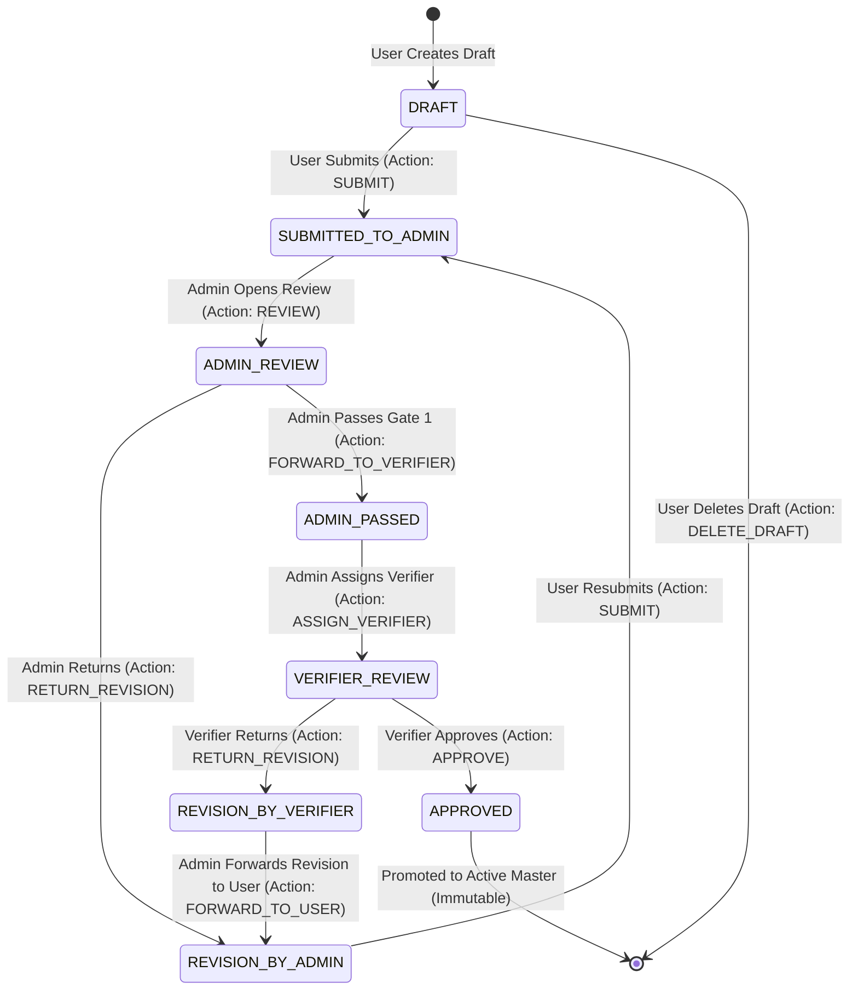

# E-SKLD — SUBMISSION STATE MACHINE SPECIFICATION V1

## 1. Formal Submission States (8 States)

The submission lifecycle consists of **8 strictly defined states**:

| State | Type | Description |
|---|---|---|
| `DRAFT` | Initial / Working | Usulan awal sedang disusun oleh User Ortala Instansi. Form dapat diedit bebas. |
| `SUBMITTED_TO_ADMIN` | Intermediate / Queue | Usulan telah diajukan dan masuk ke antrean Gate 1 (Admin KemenPANRB). Form terkunci read-only bagi User. |
| `ADMIN_REVIEW` | Processing Gate 1 | Usulan sedang dibuka dan ditelaah kelengkapan administratifnya oleh Admin Gate 1. |
| `REVISION_BY_ADMIN` | Correction (Gate 1) | Admin Gate 1 mengembalikan usulan karena ketidaklengkapan dokumen/format. User dapat mengedit kembali. |
| `ADMIN_PASSED` | Gate 1 Cleared | Usulan dinyatakan lolos Gate 1 dan siap/telah ditugaskan ke Verifikator Gate 2. |
| `VERIFIER_REVIEW` | Processing Gate 2 | Verifikator Gate 2 sedang menelaah substansi kelembagaan, peta jabatan, dan analisis beban kerja. |
| `REVISION_BY_VERIFIER`| Correction (Gate 2) | Verifikator Gate 2 meminta koreksi substansi. Catatan diteruskan via Admin ke meja User. |
| `APPROVED` | Terminal / Immutable | Usulan disetujui resmi oleh Verifikator Gate 2. Snapshot dipromosikan ke Active Master Data. Terkunci permanen. |

---

## 2. Complete State Machine & Workflow Diagram



---

## 3. Strict State Transition Matrix

Arbitrary state transitions are strictly disallowed. Every transition requires atomic database validation:

| # | Current State | Trigger Action | Next State | Allowed Actor | Prerequisite Validations | Side Effects & Audit Events |
|:---:|---|---|---|---|---|---|
| **T01** | `[NONE]` | `CREATE_DRAFT` | `DRAFT` | `USER` | User has `home_institution_id` or active `CREATE` grant | Inserts `submissions`, `submission_versions` (v1), `submission_units`, `submission_positions`. Emits `TEST_SUBMISSION_DRAFT_CREATED`. |
| **T02** | `DRAFT` | `EDIT_DRAFT` | `DRAFT` | `USER` | User is author or within institutional scope | Updates `submission_units` / `submission_positions`. Emits `SUBMISSION_DRAFT_UPDATED`. |
| **T03** | `DRAFT` | `DELETE_DRAFT` | `[DELETED]` | `USER` | State is strictly `DRAFT` | Hard deletes draft snapshot units & positions. Emits `SUBMISSION_DRAFT_DELETED`. |
| **T04** | `DRAFT` | `SUBMIT` | `SUBMITTED_TO_ADMIN` | `USER` | Draft has $\ge 1$ root unit and valid structure | Updates `submissions.current_state`, sets `submission_versions.submitted_at = NOW()`. Emits `SUBMISSION_SUBMITTED_GATE1`. |
| **T05** | `SUBMITTED_TO_ADMIN` | `START_REVIEW` | `ADMIN_REVIEW` | `ADMIN` | Admin has institution in `user_scopes` | Inserts `verification_records` (Gate 1). Emits `GATE1_REVIEW_STARTED`. |
| **T06** | `ADMIN_REVIEW` | `RETURN_REVISION` | `REVISION_BY_ADMIN` | `ADMIN` | Admin provides $\ge 1$ `revision_notes` | Updates `verification_records` (`RETURNED_FOR_REVISION`), updates state. Emits `GATE1_REVISION_REQUESTED`. |
| **T07** | `REVISION_BY_ADMIN` | `SUBMIT` | `SUBMITTED_TO_ADMIN` | `USER` | User marked all required `revision_notes` resolved | Updates state, sets `submitted_at = NOW()`. Emits `SUBMISSION_RESUBMITTED_GATE1`. |
| **T08** | `ADMIN_REVIEW` | `PASS_GATE_1` | `ADMIN_PASSED` | `ADMIN` / `SUPER_ADMIN` | Admin completed administrative checklist | Updates `verification_records` (`PASSED`), updates state. Emits `GATE1_PASSED`. |
| **T09** | `ADMIN_PASSED` | `ASSIGN_VERIFIER` | `VERIFIER_REVIEW` | `ADMIN` / `SUPER_ADMIN` | Target Verifier has active cluster scope | Inserts `verifier_assignments` (`ASSIGNED`), updates state to `VERIFIER_REVIEW`. Emits `VERIFIER_ASSIGNED`. |
| **T10** | `VERIFIER_REVIEW` | `RETURN_REVISION` | `REVISION_BY_VERIFIER`| `VERIFIER` (Assigned) | Verifier provides substantive `revision_notes` | Inserts `verification_records` (Gate 2, `RETURNED_FOR_REVISION`), updates state. Emits `GATE2_REVISION_REQUESTED`. |
| **T11** | `REVISION_BY_VERIFIER`| `FORWARD_TO_USER` | `REVISION_BY_ADMIN` | `ADMIN` / `SUPER_ADMIN` | Admin reviews Verifier notes | Updates state to `REVISION_BY_ADMIN` so User can edit. Emits `GATE2_REVISION_FORWARDED_TO_USER`. |
| **T12** | `VERIFIER_REVIEW` | `APPROVE` | `APPROVED` | `VERIFIER` (Assigned) | Substantive review complete, SK number provided | Inserts `approval_records`, marks assignment `COMPLETED`, promotes snapshot to `organizational_units` & `positions`, updates state. Emits `GATE2_FINAL_APPROVED`. |

---

## 4. Hierarchical Revision Flow (No Gate Bypassing)

The revision flow strictly adheres to the chain of custody:

```
[VERIFIER Gate 2 Requests Revision]
               │ (Status: REVISION_BY_VERIFIER)
               ▼
[ADMIN Gate 1 Intermediary Reviews Notes]
               │ (Action: FORWARD_TO_USER -> Status: REVISION_BY_ADMIN)
               ▼
[USER Ortala Edits Proposal & Resolves Notes]
               │ (Action: SUBMIT -> Status: SUBMITTED_TO_ADMIN)
               ▼
[ADMIN Gate 1 Verifies Corrections]
               │ (Action: PASS_GATE_1 -> Status: ADMIN_PASSED -> VERIFIER_REVIEW)
               ▼
[VERIFIER Gate 2 Re-evaluates & Approves]
               │ (Status: APPROVED)
```

**Rule**: A User can **never** submit directly to a Verifier, and a Verifier's revision request is always routed through the Admin Gate 1 coordinator to maintain institutional auditability.
