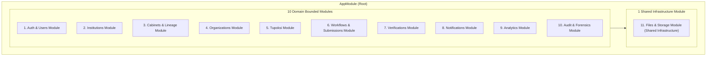

# SIGMA-K — BACKEND MODULE BOUNDARIES & DOMAIN ISOLATION

> **Dokumen:** `02_BACKEND_MODULE_BOUNDARIES.md`  
> **Status:** `ARCHITECTURAL BLUEPRINT (PHASE 5A DESIGN - REVIEWED)`  
> **Tanggal:** 2026-08-25  
> **Author:** Senior Backend Architect  
> **Klasifikasi:** 10 Domain Bounded Modules + 1 Shared Infrastructure Module  

---

## 1. Rationale Pengelompokan Modul (Domain Consolidation)

Arsitektur backend SIGMA-K mengorganisasikan 18 domain area fungsional ke dalam **10 Domain Bounded Modules** dan **1 Shared Infrastructure Module**. Pengelompokan ini membedakan secara tegas antara modul bisnis (*business domain bounded contexts*) dengan modul infrastruktur pendukung (*shared cross-cutting infrastructure*):

---

## 2. Rincian 10 Domain Bounded Modules

### 1. `AuthModule` & `UsersModule` (Domain Module)
- **Domain Scope:** Otentikasi sesi sementara (JWT provisional), RBAC, profil pengguna, dan penetapan scope instansi pengguna (*Institution Scope Context*).
- **Tabel Basis Data Pengampu:** `users`, `roles`, `user_roles`, `user_institution_scopes`.
- **Ekspor Publik:** `AuthService`, `JwtAuthGuard`, `RolesGuard`, `InstitutionScopeGuard`.

### 2. `InstitutionsModule` (Domain Module)
- **Domain Scope:** Katalog master seluruh Kementerian, LPNK, LNS, dan 548 Pemerintah Daerah. Profil instansi terpadu, domisili, kontak resmi, dan dokumen regulasi pembentukan.
- **Tabel Basis Data Pengampu:** `institutions`, `institution_profiles`, `institution_types`, `regions`.

### 3. `CabinetsModule` (Domain Module)
- **Domain Scope:** Riwayat kabinet kepresidenan, keanggotaan 48 K/L kabinet aktif, silsilah transformasi kelembagaan (*lineage*), dan logika komparasi delta antar-kabinet (*Diff Engine*).
- **Tabel Basis Data Pengampu:** `cabinets`, `cabinet_periods`, `cabinet_memberships`, `institution_lineage`.

### 4. `OrganizationsModule` (Domain Module)
- **Domain Scope:** Bagan struktur unit organisasi hierarkis (*Adjacency List `parent_id`*), data pimpinan pengampu, alokasi jumlah staf, dan tingkatan eselon jabatan.
- **Tabel Basis Data Pengampu:** `organization_units`, `echelon_levels`.
- **Aturan Domain Kunci:** **Anti-Circular Dependency DFS Guard** untuk mencegah siklus atasan-bawahan melingkar sebelum mutasi `parent_id` disimpan ke database.

### 5. `TupoksiModule` (Domain Module)
- **Domain Scope:** Katalog butir mandat tugas pokok (*duty*) dan rincian fungsi (*function*) yang terikat pada unit organisasi dan berdasar rujukan pasal regulasi hukum.
- **Tabel Basis Data Pengampu:** `tupoksi_items`.

### 6. `WorkflowsModule` (Domain Module — Submissions & State Machine)
- **Domain Scope:** Pengelolaan tiket usulan perubahan dari operator kementerian, butir perubahan draf (*Submission Items with JSON snapshot*), riwayat perbaikan revisi (*Submission Revisions*), pengiriman ulang revisi (*Resubmission*), dan mesin evaluasi status pengajuan (*Configurable Workflow State Machine Engine*).
- **Tabel Basis Data Pengampu:** `submission_tickets`, `submission_items`, `submission_revisions`.

### 7. `VerificationsModule` (Domain Module)
- **Domain Scope:** Antrean telaah berkas pengajuan masuk bagi Analis Kelembagaan KemenPANRB, ruang telaah komparasi berdampingan (*Side-by-Side Review*), dan perekaman keputusan (*Pass, Request Revision, Reject*).
- **Tabel Basis Data Pengampu:** `verification_logs`.

### 8. `NotificationsModule` (Domain Module)
- **Domain Scope:** Pusat notifikasi realtime berbasis peristiwa alur kerja, mutasi master data, dan keamanan akun. Pengelolaan status baca (*read status*).
- **Tabel Basis Data Pengampu:** `notifications`.

### 9. `AnalyticsModule` (Domain Module)
- **Domain Scope:** Agregasi intelijensi data kelembagaan untuk SESDEP: formula Proposed KPIs (rasio delayering jabatan fungsional, indeks kesiapan 48 K/L, SLA kecepatan telaah verifikasi) dan visualisasi postur formasi ASN.
- **Strategi Akses Data:** Kueri read-model / Materialized View terisolasi (*OLTP/OLAP separation*).

### 10. `AuditModule` (Domain Module)
- **Domain Scope:** Pencatatan log audit forensik tak-terhapuskan (*immutable audit log*) atas seluruh mutasi data, telaah verifikator, dan pengesahan master data dengan snapshot JSON `old_values` vs `new_values`.
- **Tabel Basis Data Pengampu:** `audit_logs` (dengan kolom JSONB dan GIN index).

---

## 3. Rincian 1 Shared Infrastructure Module

### 11. `FilesModule` (Shared Infrastructure Module)
- **Lingkup:** Modul utilitas infrastruktur lintas domain untuk menangani operasi I/O berkas fisik (salinan PDF regulasi dasar hukum, logo instansi).
- **Klasifikasi:** **Shared Infrastructure** (Bukan Domain Bounded Context bisnis).
- **Arsitektur Driver:** Pola *Pluggable Storage Driver* (`LocalStorageDriver` untuk pengembangan lokal dan `S3StorageDriver` untuk staging/produksi MinIO/AWS S3).
