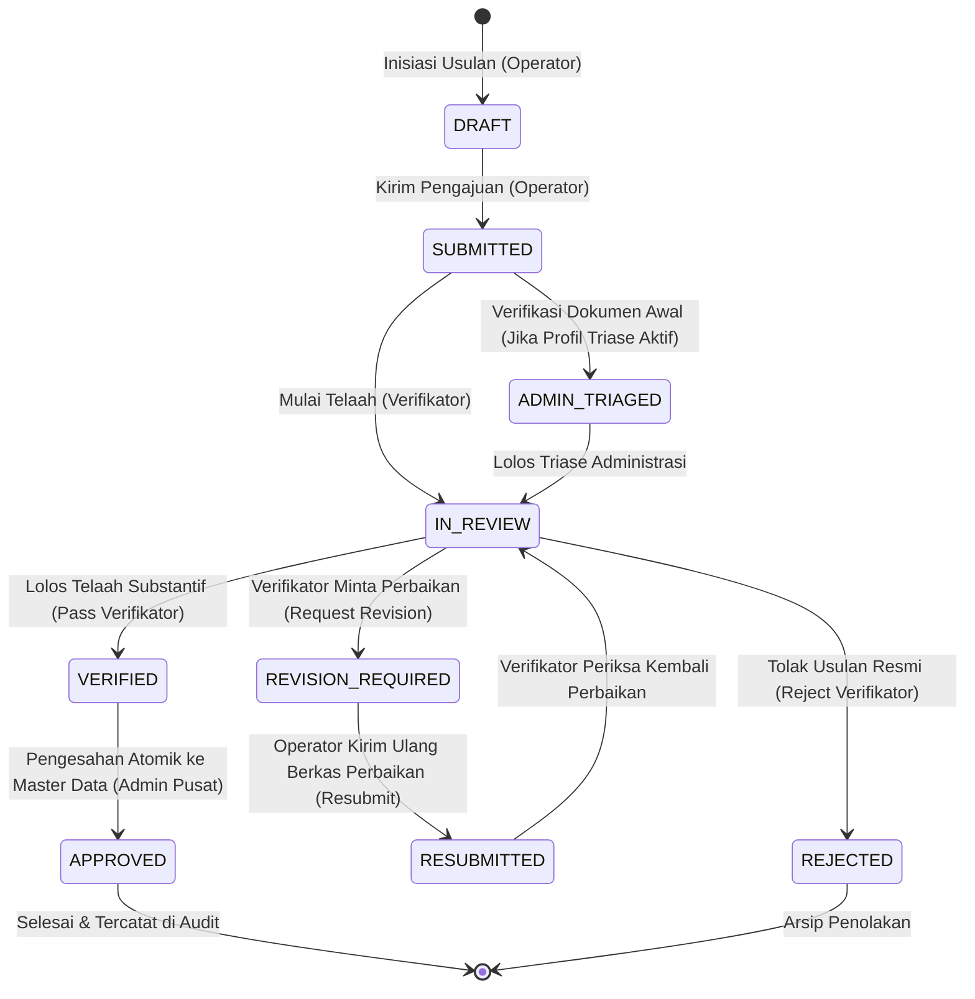

# SIGMA-K — WORKFLOW ENGINE & STATE MACHINE API CONTRACT

> **Dokumen:** `06_WORKFLOW_API_CONTRACT.md`  
> **Status:** `WORKFLOW ARCHITECTURE SPECIFICATION (PHASE 5A DESIGN - REVIEWED)`  
> **Pola Desain:** Data-Driven Configurable State Machine Engine (No Hardcoded Conditionals)  

---

## 1. Arsitektur Mesin Status Alur Kerja (*State Machine Engine*)

Alur kerja pengajuan perubahan kelembagaan dirancang menggunakan pola **Configurable State Machine**. Logika transisi tidak di-*hardcode* di dalam controller ataupun antarmuka pengguna, melainkan dievaluasi oleh mesin aturan (*Rules Evaluator*) berdasarkan konfigurasi profil alur kerja aktif (*Workflow Profile*):



---

## 2. Entitas Konseptual Konfigurasi Alur Kerja (*Workflow Configuration Entities*)

Arsitektur mesin alur kerja backend memodelkan konfigurasi alur kerja ke dalam entitas-entitas konseptual berikut:

1. **`WorkflowProfile`:** Profil alur kerja yang mendefinisikan skema proses aktif (misal: `STANDARD_PROFILE` atau `TRIAGE_PROFILE`, lihat `OPEN-002`).
2. **`WorkflowState`:** Entitas status valid dalam siklus pengajuan (`DRAFT`, `SUBMITTED`, `ADMIN_TRIAGED`, `IN_REVIEW`, `REVISION_REQUIRED`, `RESUBMITTED`, `VERIFIED`, `APPROVED`, `REJECTED`).
3. **`WorkflowTransition`:** Entitas aturan perpindahan status dari `fromState` ke `toState`.
4. **`AllowedRole`:** Peran yang memiliki wewenang mengeksekusi transisi tertentu (`USER`, `VERIFIKATOR`, `ADMIN`).
5. **`RequiredPermission`:** Hak izin spesifik yang diwajibkan untuk menjalankan aksi (misal: `submission.resubmit`, `submission.verify`).
6. **`Conditions`:** Syarat kontekstual tambahan (misal: `requiresNote: true` pada permintaan revisi/penolakan, atau kepemilikan tiket pada operator).

---

## 3. Definisi Status Alur Kerja (*Workflow States Map*)

| Status (`state`) | Nama Tampilan | Varian Badge | Deskripsi Fungsional |
| :--- | :--- | :---: | :--- |
| `DRAFT` | Draf Usulan | `secondary` | Penyusunan data usulan perubahan oleh Operator Instansi. |
| `SUBMITTED` | Diajukan | `info` | Berkas usulan terkirim dan masuk ke antrean pusat KemenPANRB. |
| `ADMIN_TRIAGED` | Telah Ditriase | `info` | Pemeriksaan kelengkapan administrasi awal oleh Admin Pusat (*Opsional Triase*). |
| `IN_REVIEW` | Sedang Ditelaah | `warning` | Pemeriksaan substantif kesesuaian dokumen regulasi oleh Verifikator. |
| `REVISION_REQUIRED` | Perlu Revisi | `danger` | Verifikator mengembalikan berkas dengan catatan poin perbaikan. |
| `RESUBMITTED` | Revisi Terkirim | `info` | Operator mengirimkan perbaikan dan tanggapan atas catatan verifikator. |
| `VERIFIED` | Lolos Verifikasi | `primary` | Telaah substantif disetujui dan direkomendasikan untuk pengesahan. |
| `APPROVED` | Disahkan | `success` | Perubahan diterapkan secara atomik ke Master Data SIGMA-K aktif. |
| `REJECTED` | Ditolak | `danger` | Usulan ditolak resmi dengan alasan substantif tercatat. |

---

## 4. Matriks Transisi Lengkap Siklus Pengajuan & Revisi (*Transition Rules Table*)

```json
[
  {
    "transitionId": "TR-01",
    "fromState": "DRAFT",
    "toState": "SUBMITTED",
    "action": "SUBMIT",
    "allowedRoles": ["USER", "ADMIN"],
    "requiredPermissions": ["submission.submit"],
    "requiresNote": false
  },
  {
    "transitionId": "TR-02",
    "fromState": "SUBMITTED",
    "toState": "IN_REVIEW",
    "action": "START_REVIEW",
    "allowedRoles": ["VERIFIKATOR", "ADMIN"],
    "requiredPermissions": ["submission.review"],
    "requiresNote": false
  },
  {
    "transitionId": "TR-03",
    "fromState": "IN_REVIEW",
    "toState": "VERIFIED",
    "action": "PASS_VERIFICATION",
    "allowedRoles": ["VERIFIKATOR", "ADMIN"],
    "requiredPermissions": ["submission.verify"],
    "requiresNote": true
  },
  {
    "transitionId": "TR-04",
    "fromState": "IN_REVIEW",
    "toState": "REVISION_REQUIRED",
    "action": "REQUEST_REVISION",
    "allowedRoles": ["VERIFIKATOR", "ADMIN"],
    "requiredPermissions": ["submission.request_revision"],
    "requiresNote": true
  },
  {
    "transitionId": "TR-05",
    "fromState": "IN_REVIEW",
    "toState": "REJECTED",
    "action": "REJECT",
    "allowedRoles": ["VERIFIKATOR", "ADMIN"],
    "requiredPermissions": ["submission.reject"],
    "requiresNote": true
  },
  {
    "transitionId": "TR-06",
    "fromState": "REVISION_REQUIRED",
    "toState": "RESUBMITTED",
    "action": "RESUBMIT",
    "allowedRoles": ["USER", "ADMIN"],
    "requiredPermissions": ["submission.resubmit"],
    "requiresNote": true
  },
  {
    "transitionId": "TR-07",
    "fromState": "RESUBMITTED",
    "toState": "IN_REVIEW",
    "action": "RESUME_REVIEW",
    "allowedRoles": ["VERIFIKATOR", "ADMIN"],
    "requiredPermissions": ["submission.review"],
    "requiresNote": false
  },
  {
    "transitionId": "TR-08",
    "fromState": "VERIFIED",
    "toState": "APPROVED",
    "action": "APPROVE_MASTER",
    "allowedRoles": ["ADMIN"],
    "requiredPermissions": ["submission.approve"],
    "requiresNote": false
  }
]
```

---

## 5. Endpoints API Alur Kerja & Siklus Revisi

### 1. `POST /api/v1/verifications/:id/request-revision` (Aksi Verifikator)
- **Tujuan:** Verifikator mengembalikan berkas pengajuan dengan catatan resmi butir perbaikan (`IN_REVIEW` $\rightarrow$ `REVISION_REQUIRED`).
- **Payload Request:**
```json
{
  "decision": "REVISION_REQUIRED",
  "notes": "Mohon lengkapi rujukan pasal regulasi Perpres No. 190/2024 dan sesuaikan nomenklatur unit kerja."
}
```

### 2. `POST /api/v1/submissions/:id/resubmit` (Aksi Operator)
- **Tujuan:** Operator mengirimkan kembali berkas yang telah diperbaiki ke antrean telaah verifikator (`REVISION_REQUIRED` $\rightarrow$ `RESUBMITTED`).
- **Payload Request:**
```json
{
  "operatorResponseNote": "Rujukan pasal regulasi telah disesuaikan pada lampiran dan nomenklatur unit kerja telah diperbaiki.",
  "revisedItems": [
    {
      "submissionItemId": "item-001",
      "payloadAfter": {
        "unitName": "Direktorat Standardisasi Tata Kelola",
        "legalArticleReference": "Perpres No. 190/2024 Pasal 5 ayat (2)"
      }
    }
  ]
}
```

### 3. `GET /api/v1/workflow/config`
- **Output:** Metadata profil alur kerja aktif, daftar status, dan aturan transisi yang berlaku.
