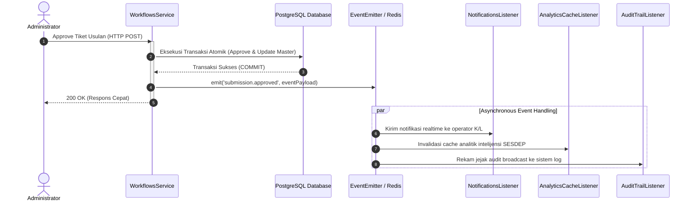

# SIGMA-K — EVENT BOUNDARIES & REALTIME DISPATCH SPECIFICATION

> **Dokumen:** `11_EVENT_BOUNDARIES.md`  
> **Status:** `EVENT-DRIVEN ARCHITECTURE SPECIFICATION (PHASE 5A DESIGN - REVIEWED)`  
> **Pola Desain:** Domain Event Pattern (`@nestjs/event-emitter` pada proses monolit, siap beralih ke Redis Pub/Sub)  

---

## 1. Arsitektur Peristiwa Domain (*Domain Events Architecture*)

Untuk menjaga modularitas antar-modul dan mencegah ketergantungan erat (*tight coupling*), modul bisnis memancarkan **Domain Events** asinkron setelah transaksi database berhasil di-*commit*:

---

## 2. Katalog Lengkap Peristiwa Domain (*Domain Event Catalog*)

| Nama Peristiwa (*Event Name*) | Modul Produser (*Producer*) | Modul Konsumen (*Consumer*) | Tujuan & Dampak Asinkron |
| :--- | :--- | :--- | :--- |
| **`submission.submitted`** | `WorkflowsModule` | `NotificationsModule`, `AuditModule` | Membuat notifikasi antrean telaah baru bagi seluruh Analis Kelembagaan KemenPANRB. |
| **`verification.revision_requested`** | `VerificationsModule` | `NotificationsModule` | Mengirimkan pemberitahuan mendesak beserta catatan butir perbaikan kepada Operator pengusul. |
| **`submission.resubmitted`** | `WorkflowsModule` | `NotificationsModule`, `VerificationsModule` | Memberitahu Analis Verifikator bahwa berkas perbaikan revisi telah dikirimkan kembali oleh operator. |
| **`verification.pass`** | `VerificationsModule` | `NotificationsModule`, `AuditModule` | Memberitahu Administrator Pusat bahwa berkas telah siap disahkan ke Master Data aktif. |
| **`submission.approved`** | `WorkflowsModule` | `NotificationsModule`, `AnalyticsModule`, `AuditModule` | Mengirimkan konfirmasi pengesahan ke kementerian pengusul dan memicu *refresh* cache analitik data kelembagaan. |
| **`submission.rejected`** | `VerificationsModule` | `NotificationsModule`, `AuditModule` | Memberitahukan penolakan usulan beserta alasan resmi ke operator pengusul. |
| **`notification.created`** | `NotificationsModule` | `RealtimeGateway` (WebSocket/SSE) | Mendorong (*push*) pesan notifikasi langsung ke bilah navigasi antarmuka peramban pengguna aktif secara instan. |
| **`institution.updated`** | `InstitutionsModule` | `AnalyticsModule`, `AuditModule` | Menghitung ulang agregasi profil instansi pada model analitik. |
| **`cabinet.lineage_changed`**| `CabinetsModule` | `AnalyticsModule` | Mengkalkulasi ulang matriks delta perubahan kabinet untuk layar perbandingan pimpinan. |

---

## 3. Batasan Implementasi Phase 5A
- Pada perancangan Phase 5A ini, seluruh tanda tangan event di atas didefinisikan sebagai kontrak antarmuka TypeScript.
- Infrastruktur fisik Redis Pub/Sub dan Socket.io gateway **TIDAK DI-DEPLOY** pada fase ini, melainkan akan dihubungkan pada tahap implementasi Phase 5B.
