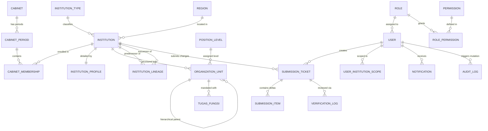
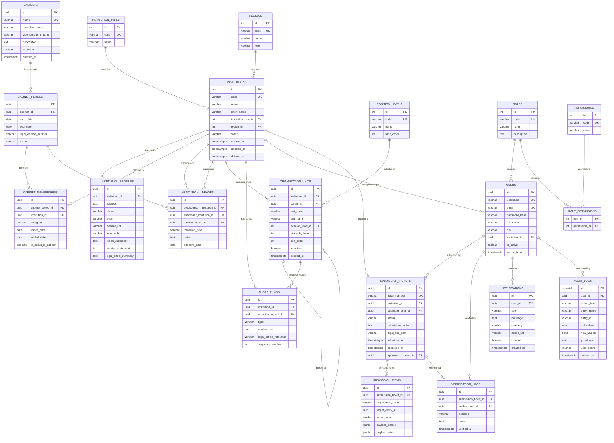

# 09. ENTITY RELATIONSHIP DIAGRAM (ERD): SIGMA-K

> **Status:** DATA ARCHITECTURE BASELINE  
> **Versi Dokumen:** 1.0.0  
> **Tanggal:** 2026-08-25  
> **Author:** Senior Database Architect & Lead Full-Stack Engineer  

Dokumen ini memvisualisasikan diagram relasi entitas (*Entity Relationship Diagram - ERD*) konseptual dan logis untuk sistem SIGMA-K menggunakan notasi standar Mermaid.

---

## 1. Conceptual ERD (High-Level Domain Overview)

---

## 2. Logical ERD (Detailed Physical/Logical Attributes)

