# SIGMA-K — INFORMATION ARCHITECTURE & SITEMAP

## 1. Arsitektur Informasi & Pengelompokan Modul

Sistem navigasi SIGMA-K dikelompokkan ke dalam 5 pilar arsitektur informasi terstruktur:

```mermaid
graph TD
    Root["SIGMA-K App Root (/)"] --> Dash["1. Dashboard Eksekutif"]
    
    Root --> Master["2. Kabinet & Master Data"]
    Master --> CabList["Manajemen Kabinet (/cabinets)"]
    Master --> CabDetail["Detail Kabinet (/cabinets/[id])"]
    Master --> CabNew["Tambah Kabinet (/cabinets/new)"]
    Master --> CabCompare["Komparasi Kabinet (/cabinets/compare)"]
    Master --> InstCat["Katalog Instansi (/institutions)"]
    Master --> InstDetail["Profil Instansi (/institutions/[id])"]
    
    Root --> Org["3. Struktur & Kelembagaan"]
    Org --> OrgCanvas["Bagan Organisasi React Flow (/structure)"]
    Org --> Tupoksi["Tugas dan Fungsi (/tupoksi)"]
    
    Root --> Work["4. Tata Kelola & Workflow"]
    Work --> SubList["Daftar Pengajuan Usulan (/submissions)"]
    Work --> SubDetail["Detail Pengajuan & Stepper (/submissions/[id])"]
    Work --> SubRev["Form Perbaikan Revisi (/submissions/[id]/revision)"]
    Work --> VerQueue["Antrean Verifikasi (/verifications)"]
    Work --> VerSpace["Ruang Telaah Berdampingan (/verifications/[id])"]
    
    Root --> Intel["5. Intelijensi & Audit"]
    Intel --> Analytics["Analitik & Postur ASN (/analytics)"]
    Intel --> AuditTrail["Audit Trail Forensik (/audit-logs)"]
    Intel --> Notifs["Pusat Notifikasi (/notifications)"]
```

---

## 2. Struktur Navigasi Global

### TopBar Navigation (Sticky Header)
- **Identitas Brand:** Logo SIGMA-K Garuda Gold, teks identitas KemenPANRB, badge "PROTOTYPE".
- **Demo Persona Switcher (Dropdown):** Memungkinkan perpindahan instan antar-peran (`USER`, `VERIFIKATOR`, `ADMIN`, `SESDEP`).
- **Pusat Notifikasi (Bell Trigger):** Menampilkan badge jumlah pemberitahuan belum dibaca (*unread count*) dan memicu pembukaan *Drawer* notifikasi.
- **Profil Pengguna:** Nama aktif dan kementerian pengampu.

### Sidebar Navigation (Role-Filtered)
- **Menu Utama:** Dashboard Eksekutif (`/`).
- **Kabinet & Master Data:** Manajemen Kabinet (`/cabinets`), Komparasi Kabinet (`/cabinets/compare`), Katalog Master Instansi (`/institutions`).
- **Struktur & Kelembagaan:** Bagan Struktur Interaktif (`/structure`), Tugas dan Fungsi (`/tupoksi`).
- **Tata Kelola & Workflow:** Pengajuan Usulan (`/submissions`), Antrean Verifikasi (`/verifications` — khusus Verifikator/Admin).
- **Intelijensi & Audit:** Analitik & Postur ASN (`/analytics`), Audit Trail Forensik (`/audit-logs` — khusus Admin/SESDEP).
