# SIGMA-K — INFORMATION ARCHITECTURE & SITEMAP

## 1. Navigational Structure
Arsitektur informasi SIGMA-K dikelompokkan ke dalam 5 pilar utama yang diakses melalui Sidebar dan TopBar terpadu:

```mermaid
graph TD
    Root["SIGMA-K App Root (/)"] --> Dash["1. Dashboard Eksekutif"]
    
    Root --> Master["2. Kabinet & Master Data"]
    Master --> CabList["Manajemen Kabinet (/cabinets)"]
    Master --> CabDetail["Detail Kabinet (/cabinets/[id])"]
    Master --> CabNew["Tambah Kabinet (/cabinets/new)"]
    Master --> CabCompare["Komparasi Kabinet (/cabinets/compare)"]
    Master --> InstCat["Katalog Instansi (/institutions)"]
    Master --> InstDetail["Profil Instansi (/institutions/[id])"]
    
    Root --> Org["3. Struktur & Kelembagaan"]
    Org --> OrgCanvas["Bagan Organisasi React Flow (/structure)"]
    Org --> Tupoksi["Tugas dan Fungsi (/tupoksi)"]
    
    Root --> Work["4. Tata Kelola & Workflow"]
    Work --> SubList["Daftar Pengajuan Usulan (/submissions)"]
    Work --> SubDetail["Detail Pengajuan & Stepper (/submissions/[id])"]
    Work --> SubRev["Form Perbaikan Revisi (/submissions/[id]/revision)"]
    Work --> VerQueue["Antrean Verifikasi (/verifications)"]
    Work --> VerSpace["Ruang Telaah Berdampingan (/verifications/[id])"]
    
    Root --> Intel["5. Intelijensi & Audit"]
    Intel --> Analytics["Analitik & Postur ASN (/analytics)"]
    Intel --> AuditTrail["Audit Trail Forensik (/audit-logs)"]
    Intel --> Notifs["Pusat Notifikasi (/notifications)"]
```

---

## 2. Peta Rute URL Next.js App Router (16 Screens)

| ID Layar | Rute URL (`Path`) | Modul Fungsional | Deskripsi Singkat |
| :--- | :--- | :--- | :--- |
| **SCR-01** | `/` | Dashboard | Ringkasan eksekutif 48 K/L Kabinet Merah Putih, 548 Pemda, dan metrik usulan. |
| **SCR-02** | `/cabinets` | Master Kabinet | Katalog era kepresidenan (Indonesia Maju, Merah Putih, dll). |
| **SCR-03** | `/cabinets/new` | Master Kabinet | Formulir pendaftaran kabinet baru berdasar Keppres RI. |
| **SCR-04** | `/cabinets/[id]` | Master Kabinet | Komposisi keanggotaan kementerian koordinator dan teknis per kabinet. |
| **SCR-05** | `/cabinets/compare` | Komparasi Kabinet | **Fitur Unggulan:** Analisis visual pemecahan kementerian (*split*), instansi baru, dan perubahan nomenklatur. |
| **SCR-06** | `/institutions` | Master Instansi | Katalog master seluruh K/L dan Pemerintah Daerah se-Indonesia. |
| **SCR-07** | `/institutions/[id]` | Profil Instansi | Profil lengkap, kontak, regulasi, daftar unit, dan butir tupoksi kementerian. |
| **SCR-08** | `/tupoksi` | Kelembagaan | Master butir tugas pokok dan rincian fungsi berdasar pasal-pasal Perpres. |
| **SCR-09** | `/structure` | Struktur Organisasi | **Kanvas Interaktif React Flow:** visualisasi pohon hierarki unit struktural (*Adjacency List*). |
| **SCR-10** | `/submissions` | Workflow Usulan | Manajemen tiket pengajuan perubahan dari operator kementerian. |
| **SCR-11** | `/submissions/[id]` | Workflow Usulan | Rincian tiket pengajuan dilengkapi *WorkflowStepper* dan draf komparasi data. |
| **SCR-12A**| `/verifications` | Verifikasi | Antrean berkas pengajuan masuk untuk tim Analis Kelembagaan KemenPANRB. |
| **SCR-12B**| `/verifications/[id]` | Verifikasi | **Ruang Telaah:** Panel telaah berdampingan (*side-by-side diff*) dengan tombol keputusan *Pass/Revision/Reject*. |
| **SCR-13** | `/submissions/[id]/revision` | Workflow Usulan | Formulir penyesuaian draf data oleh operator untuk menanggapi catatan revisi verifikator. |
| **SCR-14** | `/notifications` | Notifikasi | Pusat pemberitahuan realtime untuk seluruh peristiwa mutasi data dan workflow. |
| **SCR-15** | `/analytics` | Intelijensi Data | Visualisasi postur ASN (*delayering*), kecepatan verifikasi (SLA), dan Proposed KPIs SESDEP. |
| **SCR-16** | `/audit-logs` | Keamanan & Audit | Log audit tak-terhapuskan (*immutable audit trail*) dengan snapshot JSON sebelum vs sesudah. |
