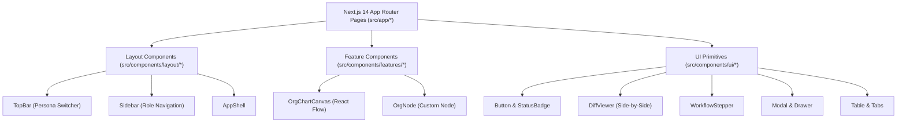

# SIGMA-K — COMPONENT ARCHITECTURE

## 1. Arsitektur Komponen Frontend
Komponen aplikasi SIGMA-K disusun secara modular dan terbagi dalam 3 lapisan hierarki:

---

## 2. Inventaris Komponen UI Primitives (`src/components/ui/`)

| Nama Komponen | Lokasi File | Deskripsi & Kegunaan |
| :--- | :--- | :--- |
| `Button` | `Button.tsx` | Tombol interaktif dengan 6 varian (`primary`, `secondary`, `outline`, `ghost`, `danger`, `gold`), ukuran (`sm`, `md`, `lg`), dan state loading spinner. |
| `Badge` | `Badge.tsx` | Label status mikro dengan 9 varian warna tematik. |
| `StatusBadge` | `StatusBadge.tsx` | Badge khusus untuk `WorkflowStatusBadge`, `TransitionBadge` (Split/New/Rename), dan `ActiveStatusBadge`. |
| `Card` | `Card.tsx` | Kontainer kartu data dengan sub-komponen `CardHeader`, `CardTitle`, `CardDescription`, `CardContent`, dan `CardFooter`. |
| `Input` & `Select` | `Input.tsx` | Kontrol formulir input teks dan dropdown select dengan label, pesan validasi error, helper text, dan ikon. |
| `Modal` | `Modal.tsx` | Dialog modal pop-up dengan latar belakang backdrop blur, tombol Escape listener, dan footer aksi. |
| `Drawer` | `Drawer.tsx` | Lembar laci samping beranimasi geser untuk panel notifikasi dan detail node pohon organisasi. |
| `Table` | `Table.tsx` | Elemen tabel terstruktur responsif dengan `TableHeader`, `TableBody`, `TableRow`, `TableHead`, dan `TableCell`. |
| `Tabs` | `Tabs.tsx` | Bilah tab horizontal dengan penghitung jumlah data (*count badge*). |
| `Breadcrumb` | `Breadcrumb.tsx` | Jejak navigasi hirarki rute aplikasi. |
| `EmptyState` | `Breadcrumb.tsx` | Tampilan visual elegan ketika hasil pencarian atau antrean data kosong. |
| `Spinner` | `Breadcrumb.tsx` | Indikator animasi loading pemuatan data asinkron. |
| `DiffViewer` | `DiffViewer.tsx` | Komponen penampil komparasi data berdampingan (*before vs after*) untuk kabinet dan usulan tiket. |
| `WorkflowStepper`| `WorkflowStepper.tsx`| Komponen visual 5 langkah siklus hidup usulan dengan penanda status dinamis. |

---

## 3. Fitur Graf Interaktif React Flow (`src/components/features/organization/`)
- `OrgNode.tsx`: Kustom node React Flow yang menampilkan tingkat eselon, nama unit kerja, pejabat pimpinan, jumlah personel, dan handle konektor atas-bawah.
- `OrgChartCanvas.tsx`: Kanvas graf visual pohon organisasi interaktif berbasis React Flow, dilengkapi mini-map, background grid, search node filter, fit view, dan zoom-pan controls.
