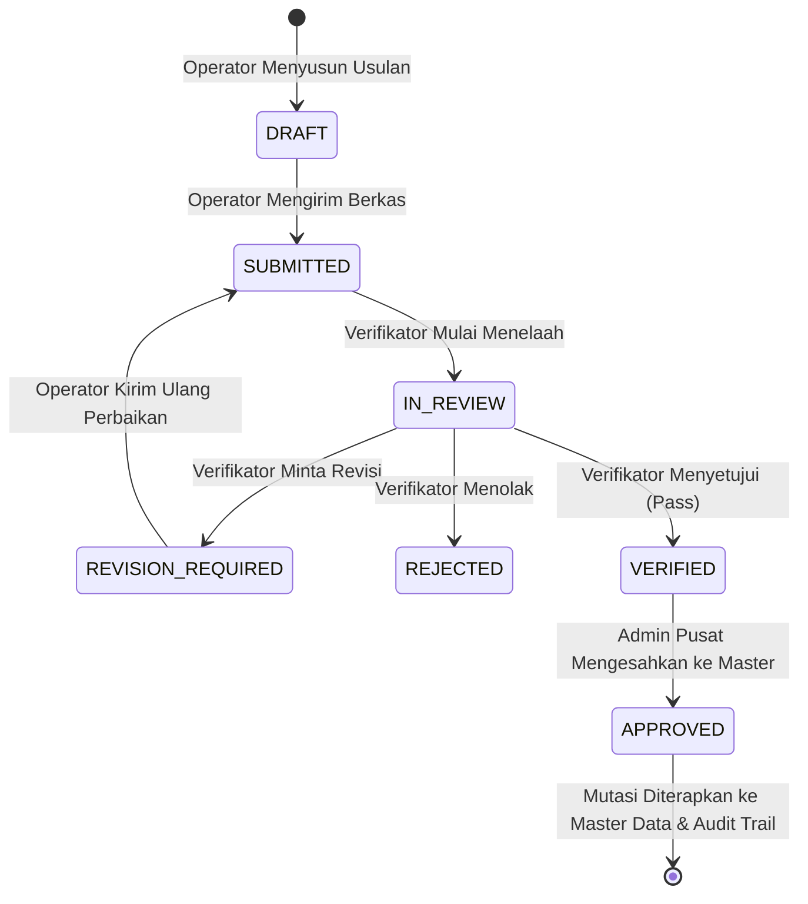

# SIGMA-K — INTERACTION FLOWS & WORKFLOW STATE MACHINE

## 1. Siklus Hidup Pengajuan (Workflow State Machine)
Setiap perubahan master data kelembagaan wajib melalui alur state machine 5 tahap yang terkontrol:

---

## 2. Alur Interaksi Kunci

### Alur 1: Penelusuran Transformasi Kabinet Merah Putih
1. Pengguna membuka menu **Komparasi Kabinet** (`/cabinets/compare`).
2. Banner komparasi secara otomatis menetapkan Kabinet Basis (Indonesia Maju) vs Kabinet Target (Merah Putih).
3. Kartu delta menampilkan ringkasan: **+7 Kementerian Baru, 3 Pemecahan, 1 Penggabungan, 5 Perubahan Nama**.
4. Pengguna memfilter tab **Pemecahan (Split)** untuk meninjau bagaimana Kemendikbudristek dipecah menjadi 3 kementerian baru.

### Alur 2: Eksplorasi Pohon Hierarki Organisasi (React Flow)
1. Pengguna membuka menu **Bagan Struktur** (`/structure`).
2. Pengguna memilih instansi **Kementerian Koordinator Bidang Pangan**.
3. Kanvas merender grafik pohon interaktif: Menko (Level 1) $\rightarrow$ Setjen & 4 Deputi (Level 2) $\rightarrow$ Biro & Asisten Deputi (Level 3).
4. Pengguna mengklik node "Deputi Bidang Koordinasi Ketersediaan Pangan" $\rightarrow$ Laci (*Drawer*) samping otomatis terbuka menampilkan profil pejabat, jumlah staf, dan butir tupoksi pengampu.

### Alur 3: Telaah Berdampingan oleh Verifikator (Side-by-Side Verification)
1. Pengguna beralih persona ke **`VERIFIKATOR`** melalui TopBar.
2. Membuka **Antrean Verifikasi** (`/verifications`) dan memilih tiket `TKT-20260825-0042` (Kemenko Pangan).
3. Sistem membuka **Ruang Telaah Berdampingan** (`/verifications/sub-001`).
4. Verifikator memeriksa panel kiri (Data Master Lama) vs panel kanan (Draf Usulan Baru).
5. Verifikator mengklik tombol **Lolos Verifikasi (Pass)** $\rightarrow$ Memasukkan catatan telaah resmi $\rightarrow$ Status tiket berubah menjadi `VERIFIED`.

### Alur 4: Pengesahan Final oleh Administrator Pusat
1. Pengguna beralih persona ke **`ADMIN`** melalui TopBar.
2. Membuka tiket pengajuan berstatus `VERIFIED` (`/submissions/sub-002`).
3. Admin mengklik tombol **Sahkan ke Master Data**.
4. Sistem secara atomik memperbarui basis data master dan mencatat transaksi ke **Audit Trail Forensik** (`/audit-logs`).
