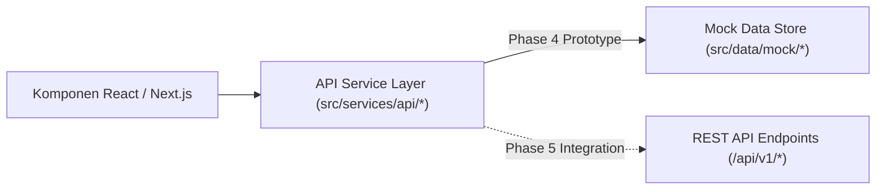

# SIGMA-K — DATA BINDING & API INTEGRATION SPECIFICATION

## 1. Arsitektur Layer Abstraksi Layanan (Service Abstraction Layer)
Untuk memastikan antarmuka prototipe dapat dihubungkan ke backend NestJS produksi tanpa mengubah komponen UI, seluruh pemanggilan data dienkapsulasi melalui kelas servis asinkron pada direktori `src/services/api/`.

---

## 2. Pemetaan Servis ke Kontrak Endpoint REST API Masa Depan

| Nama Kelas Servis | File Sumber | Method Prototipe | Target Endpoint REST API (Phase 5) |
| :--- | :--- | :--- | :--- |
| `InstitutionService` | `institution.service.ts` | `getInstitutions(params)` | `GET /api/v1/institutions` |
| | | `getInstitutionById(id)` | `GET /api/v1/institutions/:id` |
| `CabinetService` | `cabinet.service.ts` | `getCabinets()` | `GET /api/v1/cabinets` |
| | | `getCabinetById(id)` | `GET /api/v1/cabinets/:id` |
| | | `getCabinetMemberships(id)` | `GET /api/v1/cabinets/:id/memberships` |
| | | `getCabinetComparison(a, b)` | `GET /api/v1/cabinets/compare?base=:a&target=:b` |
| `OrganizationService`| `organization.service.ts`| `getOrgUnitsByInstitutionId(id)`| `GET /api/v1/institutions/:id/units` |
| | | `getTupoksiByInstitutionId(id)` | `GET /api/v1/institutions/:id/tupoksi` |
| `SubmissionService` | `submission.service.ts` | `getSubmissions(params)` | `GET /api/v1/submissions` |
| | | `getSubmissionById(id)` | `GET /api/v1/submissions/:id` |
| | | `updateStatus(id, status, notes)`| `PATCH /api/v1/submissions/:id/status` |
| `NotificationService`| `notification.service.ts`| `getNotifications()` | `GET /api/v1/notifications` |
| | | `markAsRead(id)` | `PATCH /api/v1/notifications/:id/read` |
| `AnalyticsService` | `analytics.service.ts` | `getKPIs()` | `GET /api/v1/analytics/kpis` |
| | | `getEchelonDistribution()` | `GET /api/v1/analytics/postur-asn` |
| `AuditService` | `audit.service.ts` | `getAuditLogs(params)` | `GET /api/v1/audit-logs` |

---

## 3. Struktur Skema Data Mock (`src/data/mock/`)
- `users.ts`: 4 persona akun terkonfigurasi lengkap (`USER`, `VERIFIKATOR`, `ADMIN`, `SESDEP`).
- `cabinets.ts`: 3 era kabinet kepresidenan dan 48 K/L Kabinet Merah Putih beserta relasi silsilah komparasi delta.
- `institutions.ts`: 8 instansi kementerian dan pemda lengkap dengan profil, kontak, dan regulasi dasar hukum.
- `organizations.ts`: Pohon hierarki unit kerja terstruktur berdasarkan level eselon untuk kanvas React Flow.
- `tupoksi.ts`: Butir tugas dan fungsi berdasar rujukan pasal Perpres 147/2024.
- `submissions.ts`: Tiket pengajuan perubahan kelembagaan dengan snapshot JSON sebelum vs sesudah.
- `notifications.ts`: Umpan notifikasi berbasis kategori *workflow*, *master data*, dan *security*.
- `analytics.ts`: Formulasi 4 Proposed KPIs dan distribusi eselon postur aparatur.
- `auditLogs.ts`: Rekam jejak forensik mutasi data.
