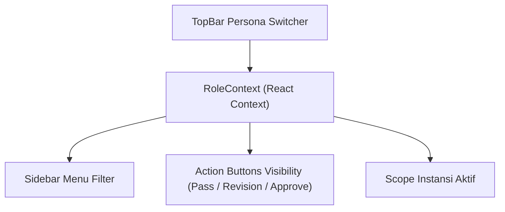

# SIGMA-K — ROLE-BASED UX & PERSONA SPECIFICATION

## 1. Mekanisme Role Switching & Konteks Pengguna
SIGMA-K menyediakan **Persona Switcher** terintegrasi pada `TopBar` yang dikelola melalui `RoleContext` (`src/context/RoleContext.tsx`). Penggantian persona langsung mengubah menu navigasi, visibilitas tombol aksi, dan hak otorisasi tampilan tanpa perlu memuat ulang halaman.

---

## 2. Matriks Hak Akses & Pengalaman Pengguna Berbasis Peran

| Modul / Fitur | `USER` (Operator K/L) | `VERIFIKATOR` (Analis PANRB) | `ADMIN` (Admin Pusat) | `SESDEP` (Pimpinan Eksekutif) |
| :--- | :---: | :---: | :---: | :---: |
| **Dashboard Eksekutif (`/`)** | View Only | View Only | View Only | **Full Executive View** |
| **Manajemen Kabinet (`/cabinets`)** | View Only | View Only | **Create & Edit** | View Only |
| **Komparasi Kabinet (`/cabinets/compare`)** | View Diff | View Diff | View Diff | **Full Diff Analysis** |
| **Katalog Master Instansi (`/institutions`)** | View Instansi | View Instansi | **Create & Edit** | View Instansi |
| **Profil & Bagan Organisasi (`/structure`)** | View Bagan | View Bagan | View Bagan | **Executive Canvas View** |
| **Pengajuan Usulan (`/submissions`)** | **Buat & Kelola Draf** | View All | View All | View All |
| **Antrean Telaah (`/verifications`)** | *Hidden* | **Telaah & Pass/Revisi** | **Telaah & Pass/Revisi** | View Queue |
| **Form Perbaikan Revisi (`/revision`)** | **Edit & Resubmit** | View Only | View Only | View Only |
| **Pengesahan ke Master Data** | *No Access* | *No Access* | **Approve to Master** | View Status |
| **Analitik & Proposed KPIs (`/analytics`)** | View KPIs | View KPIs | View KPIs | **Full Analytics View** |
| **Audit Trail Forensik (`/audit-logs`)** | *Hidden* | *Hidden* | **View & Export Log** | **View & Export Log** |

> [!IMPORTANT]
> **Catatan Kepatuhan Arsitektur:**  
> Persona `SESDEP` berfungsi sebagai sudut pandang eksekutif khusus prototipe (*Prototype Perspective*). Otorisasi permanen pada level API backend akan diimplementasikan berbasis Role-Based Access Control (RBAC) pada Phase 5.
